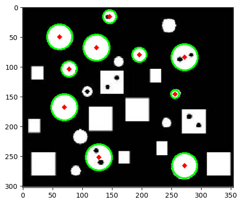

# Simple-Hough-Transform
The Hough Transform is a technique used in computer vision and image processing for detecting shapes, particularly lines and circles, within an image.
Originally developed for detecting lines, the Hough Transform has been extended to identify various shapes. This guide provides an overview of the Hough Transform techniques for detecting circles.

## Overview:

### Parameterization:
- In Cartesian coordinates, a circle is represented by the equation \((x - a)^2 + (y - b)^2 = r^2\), where \((a, b)\) is the center and \(r\) is the radius.
- The Hough Transform represents circles in a parameter space with three parameters: \(a\), \(b\), and \(r\).

### Voting:
- Each edge pixel votes for possible circles in the accumulator array.

### Accumulator Array:
- The accumulator array is a 3D array where each cell corresponds to a possible circle in parameter space.

### Peak Detection:
- Peaks in the accumulator array correspond to potential circles in the image.

### Thresholding:
- Thresholding is applied to filter out weak circles.

### Back-Transformation:
- The detected circles in the parameter space are transformed back to Cartesian coordinates for visualization.

## Original Image

## Result

